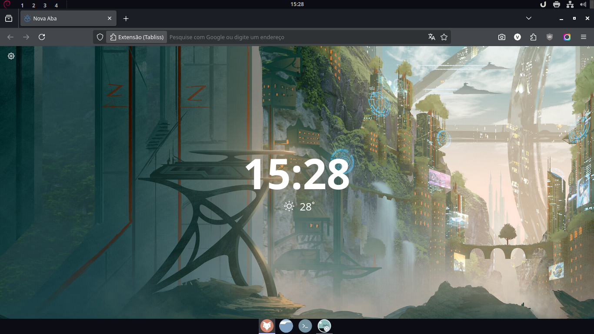
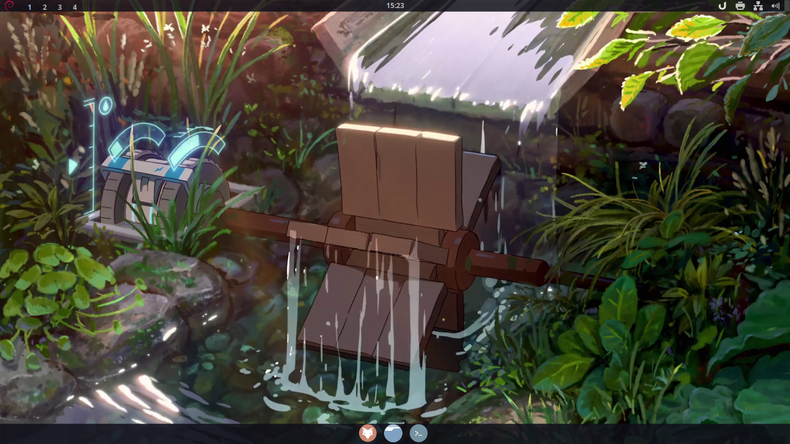
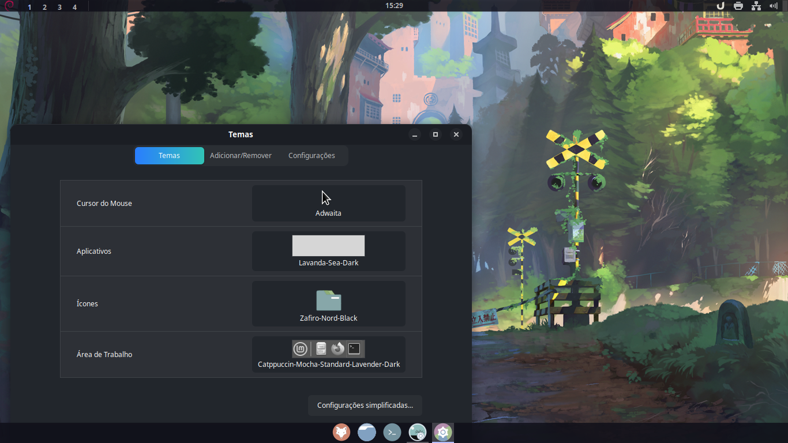
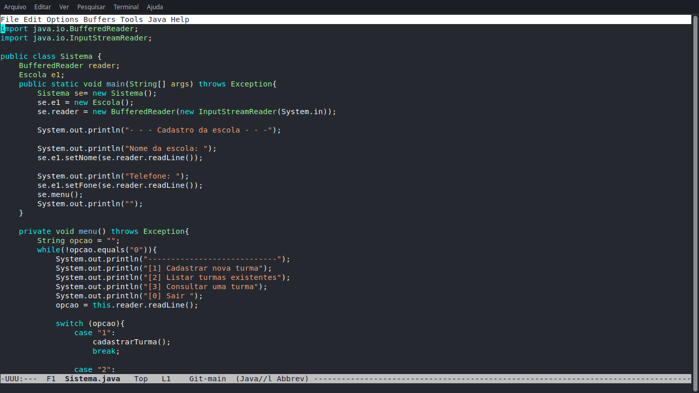
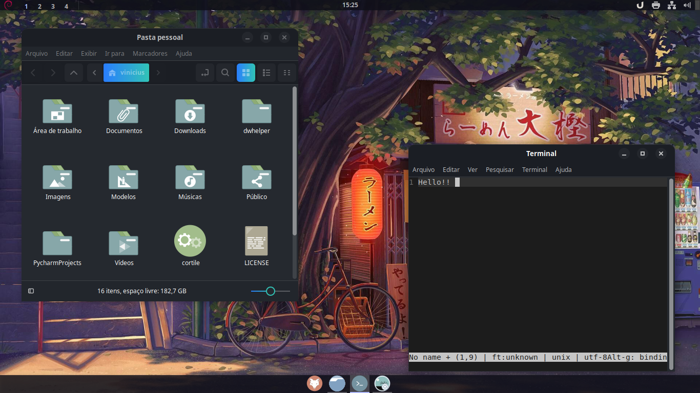

# 🪐Dotfiles

> Minhas configurações

## 📋 Tópicos
### Debian 🌀
- [Atualize o sistema e baixa o Git](#atualize-o-sistema-e-baixa-o-git---debian)
- [Instale o Flatpak](#instale-o-flatpak---debian)
- [Ulauncher](#ulauncher-repositorio-oficial---debian)
- [Principais apps](#principais-apps-apt---debian)


<div></div>

### OpenSuse 🦎
- [Atualize o sistema e baixa o Git](#atualize-o-sistema-e-baixa-o-git---opensuse)
- [Flatpak](#flatpak---opensuse)
- [Ulauncher](#ulaucherflatpack---opensuse)
- [Principais apps](#principais-apps---opensuse)

### Geral 
- [HomeBrew o gerenciador de aplicativos do Mac](https://brew.sh/)
- [Wiki do PSQL](https://www.postgresql.org/docs/current/app-psql.html)

## Visão Geral 

Este repositório é uma coleção de configurações que utilizo no meu computador Linux. Serve como um guia para deixar seu sistema semelhante ao meu, abrangendo temas, ícones, ajustes de aparência e instalação de aplicativos, algumas coisas não faço uso, mas deixo como ajuda..

## Requisitos

  - Linux sendo testado para o Debian 13 e OpenSuse.
  - Opensuse utilizado é o Tumbleweed, mas funciona com o Leap. 
  - Deve funcionar com qualquer distro derivada dos dois.
  - Git.

### Linux Power Toys 
```bash
yes | sh -c "$(curl -fsSL https://raw.githubusercontent.com/psygreg/linuxtoys/master/install.sh)"
```
Uma ferramenta de auxilio para instalação de apps.

<details> <summary> <h2> Repositorios e Gerenciadores </h2> </summary>

### Flatseal um gerenciador de permissões para flatpack. 
```bash
flatpak install flathub com.github.tchx84.Flatseal
```

### App imagepool um gerenciador de permissões para Appimage.
```bash
flatpak install flathub io.github.prateekmedia.appimagepool
```

### Cargo um gerenciador de permissões para Rust apps.
```bash
curl https://sh.rustup.rs -sSf | sh
source $HOME/.cargo/env
```
É necessario ter Flatpack habilitado confira em seu sistema.
</details>

# Debian 🌀

### Atualize o sistema e baixa o Git - Debian
```bash
sudo apt upgrade && sudo apt update -y 
sudo apt install git curl -y
```

### 📦 Instale o Flatpak - Debian
```bash
sudo apt install flatpak -y
sudo apt install gnome-software-plugin-flatpak -y
flatpak remote-add --if-not-exists flathub https://dl.flathub.org/repo/flathub.flatpakrepo
```

### Ulauncher (repositorio Oficial) - Debian
```bash
sudo apt update && sudo apt install -y gnupg
gpg --keyserver keyserver.ubuntu.com --recv 0xfaf1020699503176
gpg --export 0xfaf1020699503176 | sudo tee /usr/share/keyrings/ulauncher-archive-keyring.gpg > /dev/null
echo "deb [signed-by=/usr/share/keyrings/ulauncher-archive-keyring.gpg] \
http://ppa.launchpad.net/agornostal/ulauncher/ubuntu jammy main" \
| sudo tee /etc/apt/sources.list.d/ulauncher-jammy.list
sudo apt update && sudo apt install ulauncher
```
lembre-se de sempre deixar ele em autostart.

### Principais apps (APT) - Debian
```bash
sudo apt install ranger fastfetch flameshot  -y
```


<details> <summary> <h3> Programação (IDE's e Linguagems) - Debian  </summary>
    
  ### Vscode (repositorio Oficial)
  ```bash
      sudo apt install wget gpg -y
      wget -qO- https://packages.microsoft.com/keys/microsoft.asc | gpg --dearmor > packages.microsoft.gpg
      sudo install -o root -g root -m 644 packages.microsoft.gpg /usr/share/keyrings/
      sudo sh -c 'echo "deb [arch=amd64 signed-by=/usr/share/keyrings/packages.microsoft.gpg] \
      https://packages.microsoft.com/repos/code stable main" > /etc/apt/sources.list.d/vscode.list'
      rm -f packages.microsoft.gpg
      sudo apt update
      sudo apt install code -y
  ```
  ## Vscode (Extensões)
  ```bash
  code --install-extension ms-vscode.cpptools
  code --install-extension ms-vscode.cpptools-extension-pack
  code --install-extension franneck94.c-cpp-runner
  code --install-extension ms-vscode.cmake-tools
  code --install-extension ecmel.vscode-html-css
  code --install-extension ritwickdey.liveserver
  code --install-extension enkia.tokyo-night
  code --install-extension bmewburn.vscode-intelephense-clie  
  code --disable-extension GitHub.copilot
  code --disable-extension @builtin php
  ```

  ### Java (OpenJDK completo)
   ```bash
   sudo apt install default-jdk -y
   ```
  ### Python 
  ```bash
  sudo apt install python3 python3-pip python3-venv python3-dev build-essential -y
  ```
  ### C/C++ 
  ```bash
  sudo apt install build-essential gdb -y
  ```
  ### PHP (LAMP)
  ```bash
  sudo apt update
  sudo apt install -y apache2 php php-mysql php-mbstring php-zip php-gd php-json php-curl mariadb-server phpmyadmin
  sudo phpenmod mbstring
  sudo systemctl restart apache2
  sudo chmod 777 /var/www/html
  ```

  ### PHPmyAdmin 
  ```bash
  sudo systemctl stop mariadb
  sudo pkill -9 mysql
  sudo pkill -9 mariadb
  sudo mysqld_safe --skip-grant-tables --skip-networking &
  sleep 5
  mysql -u root <<EOF
  FLUSH PRIVILEGES;
  UPDATE mysql.user SET password = PASSWORD('bancodedados') WHERE user='root' AND host='localhost';
  UPDATE mysql.user SET plugin = 'mysql_native_password' WHERE user='root' AND host='localhost';
  FLUSH PRIVILEGES;
  EOF
  sudo pkill -f mysqld
  sudo systemctl start mariadb
  sudo sed -i "/auth_type/c\$cfg['Servers'][\$i]['auth_type'] = 'cookie';" /etc/phpmyadmin/config.inc.php
  sudo sed -i "/Servers\]\[\$i\]\['auth_type'\]/a \$cfg['Servers'][\$i]['AllowRoot'] = true;" /etc/phpmyadmin/config.inc.php
  sudo systemctl restart apache2
  ```
  ### Composer (Gereciador de dependecias do PHP)
  ```bash
  sudo apt install composer -y
  ```

  ### PostgreSQL 
  ```bash
  sudo apt install postgresql -y

  ```

  ### PGadmin
  ```bash
  curl https://www.pgadmin.org/static/packages_pgadmin_org.pub | sudo apt-key add -
  sudo sh -c 'echo "deb https://ftp.postgresql.org/pub/pgadmin/pgadmin4/apt/$(lsb_release -cs) pgadmin4 main" > /etc/apt/sources.list.d/pgadmin4.list'
  sudo apt update
  sudo apt install pgadmin4
  ```

  ### Nvim 
  ```bash
  curl -LO https://github.com/neovim/neovim/releases/latest/download/nvim-linux-x86_64.tar.gz
  sudo rm -rf /opt/nvim-linux-x86_64
  sudo tar -C /opt -xzf nvim-linux-x86_64.tar.gz
  rm nvim-linux-x86_64.tar.gz
  echo 'export PATH="$PATH:/opt/nvim-linux-x86_64/bin"' >> ~/.bashrc
  source ~/.bashrc
  
  mkdir -p ~/.local/share/fonts
  cd ~/.local/share/fonts
  wget https://github.com/ryanoasis/nerd-fonts/releases/latest/download/JetBrainsMono.zip
  unzip JetBrainsMono.zip
  rm JetBrainsMono.zip
  fc-cache -fv
  ```

  ### Geany (IDE)
  ```bash
  sudo apt install geany -y
  ```

  ### Micro (Text Editor)
  ```bash
  sudo apt install micro -y
  ```

  ### Todas.
   ```bash
   sudo apt install -y wget gpg
   wget -qO- https://packages.microsoft.com/keys/microsoft.asc | gpg --dearmor > packages.microsoft.gpg
   sudo install -o root -g root -m 644 packages.microsoft.gpg /usr/share/keyrings/
   sudo sh -c 'echo "deb [arch=amd64 signed-by=/usr/share/keyrings/packages.microsoft.gpg] \
   https://packages.microsoft.com/repos/code stable main" > /etc/apt/sources.list.d/vscode.list'
   rm -f packages.microsoft.gpg
   sudo apt update
   sudo apt install -y code default-jdk python3 python3-pip python3-venv python3-dev build-essential gdb apache2 mariadb-server php libapache2-mod-php php-mysql postgresql geany micro
   sudo systemctl enable --now apache2 mariadb
   sudo chmod 777 /var/www/html
  ```
</details>

  
</details>

<details> <summary> <h3> Jogos (principais launchers) - Debian </summary>

  ### Steam (ativa os repositorios non-free e baixa steam)
  ```bash
  sudo dpkg --add-architecture i386
  sudo apt update
  sudo apt install steam -y
  ```
  ### Heroic Laucher (epic games)
  ```bash
  flatpak install flathub com.heroicgameslauncher.hgl
  sudo reboot
  ```
  ### Minecraft (prism Launcher)
  ```bash
  flatpak install flathub org.prismlauncher.PrismLauncher
  ```
  ### Roblox (Sober)
  ```bash
  flatpak install flathub org.vinegarhq.Sober
  ```
</details>


# OpenSuse 🦎 

### Atualize o sistema e baixa o Git - OpenSuse
```bash
sudo zypper refresh
sudo zypper update -y
sudo zypper install git -y
```

### Flatpak - OpenSUSE
```bash
sudo zypper install flatpak gnome-software-plugin-flatpak -y
flatpak remote-add --if-not-exists flathub https://flathub.org/repo/flathub.flatpakrepo
```
### Ulaucher(Flatpack) - OpenSuse
```bash
flatpak install flathub com.ulauncher.Ulauncher -y
```
lembre-se de sempre deixar ele em autostart

### Principais apps - OpenSUSE
```bash
sudo zypper install ranger fastfetch flameshot gcc git -y
```

<details> <summary> <h2> Programação (IDE's e Linguagems) - OpenSuse </summary> 


### Vscode - OpenSuse
```bash
zypper ar -cf https://download.opensuse.org/repositories/devel:/tools:/ide:/vscode/openSUSE_Tumbleweed devel_tools_ide_vscode
zypper in code
```

## Vscode (Extensões)
```bash
code --install-extension ms-vscode.cpptools
code --install-extension ms-vscode.cpptools-extension-pack
code --install-extension franneck94.c-cpp-runner
code --install-extension ms-vscode.cmake-tools
code --install-extension ecmel.vscode-html-css
code --install-extension ritwickdey.liveserver
code --install-extension enkia.tokyo-night
code --install-extension bmewburn.vscode-intelephense-clie  
code --disable-extension GitHub.copilot
code --disable-extension @builtin php
```
### Java
```bash
sudo zypper install java-17-openjdk -y
```

### Python
```bash
sudo zypper install python3 python3-pip python3-venv python3-devel gcc make -y
```

### C/C++
```bash
sudo zypper install gcc gcc-c++ gdb make -y
```

### PHP (LAMP)
```bash
sudo zypper install apache2 mariadb mariadb-tools php7 php7-mysql apache2-mod_php7 -y
sudo systemctl enable apache2
sudo systemctl start apache2
sudo systemctl enable mariadb
sudo systemctl start mariadb
sudo chmod 777 /srv/www/htdocs
```

### PostgreSQL
```bash
sudo zypper install postgresql-server postgresql-contrib -y
sudo systemctl enable postgresql
sudo systemctl start postgresql
```
### Config PSQL
```bash
sudo -i -u postgres
psql 
```
```psql
ALTER USER postgres PASSWORD 'senha';
```


### Geany
```bash
sudo zypper install geany -y
```

### Micro
```bash
sudo zypper install micro -y
```

### Todas
```bash
zypper ar -cf https://download.opensuse.org/repositories/devel:/tools:/ide:/vscode/openSUSE_Tumbleweed devel_tools_ide_vscode
zypper in code
code --install-extension ms-vscode.cpptools
code --install-extension ms-vscode.cpptools-extension-pack
code --install-extension franneck94.c-cpp-runner
code --install-extension ms-vscode.cmake-tools
code --install-extension ecmel.vscode-html-css
code --install-extension ritwickdey.liveserver
code --install-extension enkia.tokyo-night
code --install-extension bmewburn.vscode-intelephense-clie
code --disable-extension GitHub.copilot
code --disable-extension @builtin php
sudo zypper install -y java-17-openjdk python3 python3-pip python3-venv python3-devel gcc gcc-c++ gdb make apache2 mariadb mariadb-tools php7 php7-mysql apache2-mod_php7 postgresql-server postgresql-contrib geany micro-editor
sudo systemctl enable --now apache2
sudo systemctl enable --now mariadb
sudo systemctl enable --now postgresql
sudo chmod 777 /srv/www/htdocs

```
</details>

<details>
  <summary> <h2> Jogos (principais launchers) - OpenSuse </h2> </summary>

### Steam
```bash
sudo zypper install steam -y
```

### Heroic Launcher
```bash
flatpak install flathub com.heroicgameslauncher.hgl -y
sudo reboot
```

### Minecraft (Prism Launcher)
```bash
flatpak install flathub org.prismlauncher.PrismLauncher -y
```

### Roblox (Sober)
```bash
flatpak install flathub org.vinegarhq.Sober -y
```
</details>

# DE`s
<details>
  <summary> <h2> Cinnamon </h2> </summary>

  ## Prints

  <p align="center">
    
    
    
    
    
  </p>

</details>

<details>
  <summary> <h2> Cosmic </h2> </summary>

## Atalhos do COSMIC

### Navegação
- **Menu de aplicativos**: `Super`
- **Abrir lançador**: `Super + Space` *(modificado)*

### Janelas
- **Mover entre janelas**: `Super + Setas`
- **Mover as janelas**: `Super + Shift + Setas`
- **Maximizar janela**: `Super + M`
- **Minimizar janela**: `Super + N` *(modificado)*
- **Redimensionar**: `Super + R`

### Áreas de trabalho
- **Mover pelas áreas de trabalho**: `Super + Ctrl + Setas`
- **Mover janelas para outras áreas**: `Super + Ctrl + Shift + Setas`

### Aplicativos
- **Abrir terminal**: `Super + T`
- **Abrir navegador**: `Super + B`


  </details>
